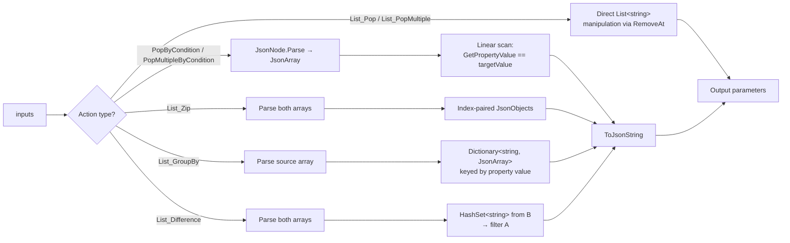

# OSListUtilsServerSide — Architecture

Structural reference for the solution, the runtime component, and the test
projects. Keep this file in sync with the code — the `documentation-updater`
agent updates it as part of the change cycle whenever the solution layout,
Server Action surface, dependency set, or project structure changes.

> **Runtime behaviour** and **Server Action signatures** live in
> [README.md](./README.md) and the [docs/platform/](./docs/platform) Forge
> copies. This document describes **structure only** — how the code is
> organised, why it is split the way it is, and where each concern lives.

---

## 1. Solution layout

```
OSListUtilsServerSide/                           ← repo root
├── ListUtils.sln                                ← solution (loads all four .csproj files)
├── ListUtils/                                   ← ODC External Library (net10.0)
├── ListUtils.Tests/                             ← ODC xUnit suite (net10.0)
├── ListUtils.O11/                               ← O11 Integration Studio extension (net48)
├── ListUtils.O11.Tests/                         ← O11 xUnit suite (net48)
└── docs/                                        ← README/Forge copies, versioned changelogs
```

---

## 2. ODC External Library — `ListUtils/`

Target framework: **`net10.0`**. Namespace: `ListUtils`.
Primary class: `ListUtils`, implementing `IListUtils`.

### Public surface

| File | Type | Purpose |
|------|------|---------|
| [IListUtils.cs](ListUtils/IListUtils.cs) | `[OSInterface]` | Declares 9 actions: `List_Pop`, `List_PopMultiple`, `List_PopByCondition`, `List_PopMultipleByCondition`, `List_PopByConditions`, `List_PopMultipleByConditions`, `List_Zip`, `List_GroupBy`, `List_Difference` |

No `[OSStructure]` types — all outputs are primitives (`string`, `List<string>`, `List<int>`).

### Implementation file

| File | Responsibility |
|------|---------------|
| [ListUtils.cs](ListUtils/ListUtils.cs) | All 7 action implementations, `GetPropertyValue` JSON helper, `ToCamelCase` property-name fallback, shared `JsonSerializerOptions` |

The file has not yet crossed the ~500-line split threshold. If new actions are
added, split into partials:

- `ListUtils.cs`           — shell + index-based pops (`List_Pop`, `List_PopMultiple`)
- `ListUtils.Json.cs`      — JSON-based actions (condition pops, zip, group-by, difference) + helpers

### Runtime dependencies

Declared in [ListUtils.csproj](ListUtils/ListUtils.csproj).

| Package | License | Purpose |
|---------|---------|---------|
| `OutSystems.ExternalLibraries.SDK` | OutSystems proprietary | `[OSInterface]`, `[OSAction]`, `[OSParameter]` attributes |

`System.Text.Json` is used but ships as part of the net10.0 BCL — no NuGet required.

### ODC processing flow



### Build & package

`ListUtils/generate_upload_package.ps1` runs
`dotnet publish -c Release -r linux-x64 --self-contained false` and zips the
publish folder into `ExternalLibrary.zip`. The 90 MB ODC upload ceiling is
enforced by the script.

---

## 3. O11 Integration Studio Extension — `ListUtils.O11/`

Target framework: **`net48`**, `LangVersion=10`. Namespace: `OutSystems.NssListUtils`.

### Public surface (Integration Studio–generated names)

| File | Type | Purpose |
|------|------|---------|
| [IssListUtils.cs](ListUtils.O11/IssListUtils.cs) | Interface | Declares `MssList_Pop`, `MssList_PopMultiple`, `MssList_PopByCondition`, `MssList_PopMultipleByCondition`, `MssList_PopByConditions`, `MssList_PopMultipleByConditions`, `MssList_Zip`, `MssList_GroupBy`, `MssList_Difference` |

No record types — all parameters use `string`, `int`, `List<string>`, `List<int>` (OutSystems-compatible primitives on both platforms).

### Implementation

| File | Responsibility |
|------|---------------|
| [Actions/ListUtilsActions.cs](ListUtils.O11/Actions/ListUtilsActions.cs) | `CssListUtils : IssListUtils` — all 7 actions, `GetPropertyValue`, `ToCamelCase`, `JsonSerializerOptions` |

Logic is functionally identical to the ODC implementation. Only differences are:
- `ss`-prefixed parameter names
- `Mss` method prefix
- `str.Substring(1)` instead of `str[1..]` (net48 C# 10 lacks range syntax)
- Explicit `new JsonSerializerOptions { ... }` instead of target-typed `new()`

### Runtime dependencies

Declared in [ListUtils.O11.csproj](ListUtils.O11/ListUtils.O11.csproj).

| Package | Version | License | Purpose |
|---------|---------|---------|---------|
| `System.Text.Json` | 8.0.5 | MIT | `JsonNode` / `JsonArray` / `JsonObject` for dynamic JSON manipulation. Not part of net48 BCL — must be added as NuGet. CVE-2024-43484 resolved at 8.0.5. |

---

## 4. Test projects

85 tests per platform × 2 = **170 tests total** across 8 test files per project.

### `ListUtils.Tests/` (ODC, net10.0)

| File | Responsibility |
|------|---------------|
| Usings.cs | `global using Xunit;` |
| ListPopTests.cs | Index-based pop tests: valid index, OOB, negative, null list, first/last element, multiple indices, null/empty indices, OOB ignored, null source, object elements |
| ListJsonTests.cs | JSON-based tests: PopByCondition/PopMultipleByCondition (match, no match, null, camelCase), Zip (equal, unequal, empty), GroupBy (groups, empty), Difference (removes, null A/B, case-insensitive) |
| ComplexStructureTests.cs | Nested objects, deep nesting, mixed value types, large structures with many fields, unicode text, special characters |
| OperatorTests.cs | Contains, StartsWith, EndsWith, NotEquals, GreaterThan, LessThan, GreaterOrEqual, LessOrEqual, symbol aliases (`!=`, `>`, `<`, `>=`, `<=`), non-numeric guard |
| NestedPathTests.cs | Dot-separated property paths (2-level and 3-level), path miss, path with operator, camelCase fallback per segment |
| CaseSensitiveTests.cs | Case-sensitive Equals, NotEquals, Contains, StartsWith on strings; case-insensitive vs case-sensitive Difference |
| ArrayIndexPathTests.cs | Fixed indices, negative indices (from end), array + dot combined, out-of-range guard, nested arrays inside arrays |
| MultiConditionTests.cs | AND/OR combinations, nested-path in condition, empty conditions guard, per-condition case sensitivity, mixed operators |

Test data is inline string literals — **no binary test files are committed**.

### `ListUtils.O11.Tests/` (O11, net48)

| File | Responsibility |
|------|---------------|
| TestHelpers.cs | O11 adapter types: `IListUtils` interface + `ListUtils` wrapper class that calls `CssListUtils.MssList_*` methods and strips `ss`/`Mss` prefixes |
| Usings.cs | `global using Xunit;` |
| ListPopTests.cs | Byte-for-byte identical to ODC |
| ListJsonTests.cs | Byte-for-byte identical to ODC |
| ComplexStructureTests.cs | Byte-for-byte identical to ODC |
| OperatorTests.cs | Byte-for-byte identical to ODC |
| NestedPathTests.cs | Byte-for-byte identical to ODC |
| CaseSensitiveTests.cs | Byte-for-byte identical to ODC |
| ArrayIndexPathTests.cs | Byte-for-byte identical to ODC |
| MultiConditionTests.cs | Byte-for-byte identical to ODC |

The adapter pattern ensures `new ListUtils()` resolves to the wrapper in the
O11 test namespace, delegating to `CssListUtils` internally. This allows all
test files to compile unchanged on both platforms.

---

## 5. Naming conventions

| Concern | ODC (`net10.0`) | O11 (`net48`) |
|---------|----------------|---------------|
| Interface | `IListUtils` | `IssListUtils` |
| Implementation | `ListUtils` | `CssListUtils` |
| Namespace | `ListUtils` | `OutSystems.NssListUtils` |
| Method names | `List_Pop`, `List_Zip`, etc. | `MssList_Pop`, `MssList_Zip`, etc. |
| Parameter prefix | *(none)* | `ss` (e.g. `ssSourceList`, `ssIndex`) |

---

## 6. Implementation patterns

### JSON manipulation (System.Text.Json.Nodes)

All JSON-based actions use the `System.Text.Json.Nodes` API:
- `JsonNode.Parse(input)!.AsArray()` for parsing
- `JsonObject` / `JsonArray` construction for output
- `item.ToJsonString()` → `JsonNode.Parse(...)` for node cloning (required because `JsonNode` tracks parent ownership)
- `ToJsonString(JsonOptions)` with `WriteIndented = false` for compact output

### Property lookup

`GetPropertyValue(JsonNode, string)` is a shared static helper:
1. Tries the exact property name via `JsonObject.TryGetPropertyValue`
2. Falls back to `ToCamelCase(propertyName)` (first letter lowered)
3. Returns `null` if neither is found

This handles the OutSystems `JSON Serialize` behaviour which produces camelCase keys from PascalCase attribute names.

### Index pop strategy

`List_PopMultiple` reverse-sorts indices before iterating. This ensures each `RemoveAt` operates on the correct position — removing index 5 before index 2 means index 2 is still valid.
