# OSListUtilsServerSide — Architecture

Structural reference for the solution, the runtime component, and the test
projects. Keep this file in sync with the code — the `documentation-updater`
agent updates it as part of the change cycle whenever the solution layout,
Server Action surface, dependency set, or project structure changes.

> **Runtime behaviour** and **Server Action signatures** live in
> [README.md](./README.md) and the [docs/platform/](./docs/platform) Forge
> copies. This document describes **structure only** — how the code is
> organised, why it is split the way it is, and where each concern lives.

---

## 1. Solution layout

```
OSListUtilsServerSide/                           ← repo root
├── ListUtils.sln                                ← solution (loads all four .csproj files)
├── ListUtils/                                   ← ODC External Library (net10.0)
├── ListUtils.Tests/                             ← ODC xUnit suite (net10.0)
├── ListUtils.O11/                               ← O11 Integration Studio extension (net48)
├── ListUtils.O11.Tests/                         ← O11 xUnit suite (net48)
└── docs/                                        ← README/Forge copies, versioned changelogs
```

---

## 2. ODC External Library — `ListUtils/`

Target framework: **`net10.0`**. Namespace: `ListUtils`.
Primary class: `ListUtils`, implementing `IListUtils`.

### Public surface

| File | Type | Purpose |
|------|------|---------|
| [IListUtils.cs](ListUtils/IListUtils.cs) | `[OSInterface]` | Declares 9 actions: `List_Pop`, `List_PopMultiple`, `List_PopByCondition`, `List_PopMultipleByCondition`, `List_PopByConditions`, `List_PopMultipleByConditions`, `List_Zip`, `List_GroupBy`, `List_Difference` |

No `[OSStructure]` types — every exposed parameter is a primitive (`string`, `int`, `bool`). All list data is passed as JSON strings (`Text`), which keeps the interface generic across any consumer Structure.

### Implementation file

| File | Responsibility |
|------|---------------|
| [ListUtils.cs](ListUtils/ListUtils.cs) | All 9 action implementations, `GetPropertyValue` + `NavigateSegment` path walker (dot navigation + array indexing), `MatchesCondition` operator evaluator, `ParseConditions` + `EvaluateConditions` multi-condition engine, `TryCompareNumeric` numeric comparator, `ToCamelCase` fallback, shared `JsonSerializerOptions` |

The file is at ~530 lines (just over the ~500-line split threshold). If more
actions are added, split into partials:

- `ListUtils.cs`           — shell + index-based pops (`List_Pop`, `List_PopMultiple`)
- `ListUtils.Condition.cs` — condition-based actions (`PopByCondition`, `PopMultipleByCondition`, `PopByConditions`, `PopMultipleByConditions`)
- `ListUtils.Relational.cs` — `List_Zip`, `List_GroupBy`, `List_Difference`
- `ListUtils.Helpers.cs`   — `GetPropertyValue`, `NavigateSegment`, `MatchesCondition`, `ParseConditions`, `EvaluateConditions`, `TryCompareNumeric`, `ToCamelCase`, `JsonOptions`

### Runtime dependencies

Declared in [ListUtils.csproj](ListUtils/ListUtils.csproj).

| Package | License | Purpose |
|---------|---------|---------|
| `OutSystems.ExternalLibraries.SDK` | OutSystems proprietary | `[OSInterface]`, `[OSAction]`, `[OSParameter]` attributes |

`System.Text.Json` is used but ships as part of the net10.0 BCL — no NuGet required.

### ODC processing flow

```mermaid
flowchart LR
    In[inputs] --> Type{Action type?}

    Type -->|List_Pop / List_PopMultiple| IndexOp[JsonNode.Parse → JsonArray<br/>RemoveAt by index<br/>&#40;reverse-sorted for PopMultiple&#41;]

    Type -->|PopByCondition /<br/>PopMultipleByCondition| ParseSingle[JsonNode.Parse → JsonArray]
    ParseSingle --> SingleScan{Search from end?}
    SingleScan -->|false / N/A for Multiple| ScanFwd[Forward scan i = 0..N]
    SingleScan -->|true &#40;Pop only&#41;| ScanBwd[Backward scan i = N-1..0]
    ScanFwd --> Eval1[For each item:<br/>GetPropertyValue&#40;path&#41; via NavigateSegment<br/>then MatchesCondition&#40;value, target, op, caseSensitive&#41;]
    ScanBwd --> Eval1

    Type -->|PopByConditions /<br/>PopMultipleByConditions| ParseMulti[ParseConditions&#40;conditionsJson&#41;<br/>→ List&lt;Condition&gt;<br/>+ JsonNode.Parse → JsonArray]
    ParseMulti --> MultiScan{Search from end?}
    MultiScan -->|false / N/A for Multiple| ScanFwdM[Forward scan]
    MultiScan -->|true &#40;Pop only&#41;| ScanBwdM[Backward scan]
    ScanFwdM --> Eval2[EvaluateConditions&#40;item, conditions, AND/OR&#41;<br/>AND: all must match<br/>OR: any must match]
    ScanBwdM --> Eval2

    Type -->|List_Zip| Zip[Parse both arrays<br/>→ index-paired JsonObjects<br/>truncate to shorter]

    Type -->|List_GroupBy| GroupBy[Parse source array<br/>→ Dictionary&lt;string, JsonArray&gt;<br/>keyed by GetPropertyValue&#40;path&#41;<br/>preserves first-seen order]

    Type -->|List_Difference| Diff[Parse both arrays<br/>→ List&lt;string&gt; of B key values<br/>→ filter A: keep if no bValue matches<br/>&#40;bValue.Any via MatchesCondition&#41;]

    Eval1 --> Serialize[ToJsonString&#40;JsonOptions&#41;]
    Eval2 --> Serialize
    Zip --> Serialize
    GroupBy --> Serialize
    Diff --> Serialize
    IndexOp --> Serialize

    Serialize --> Out[Output parameters]

    subgraph PathNav[GetPropertyValue / NavigateSegment]
        direction TB
        Path[Split path on '.'] --> Seg[Per segment:<br/>parse 'Name&#91;index&#93;' or 'Name']
        Seg --> Prop[TryGetPropertyValue&#40;name&#41;<br/>fallback camelCase]
        Prop --> Idx{Has &#91;index&#93;?}
        Idx -->|yes| Arr[Array indexing<br/>&#40;negative counts from end&#41;]
        Idx -->|no| Next[Continue to next segment]
    end

    subgraph OpMatch[MatchesCondition]
        direction TB
        Op[Normalize operator] --> Cmp{Operator type?}
        Cmp -->|Equals / NotEquals| StrEq[String cmp<br/>Ordinal / OrdinalIgnoreCase]
        Cmp -->|Contains / StartsWith / EndsWith| StrPat[String match<br/>per caseSensitive]
        Cmp -->|GreaterThan / LessThan / GreaterOrEqual / LessOrEqual| Num[TryCompareNumeric<br/>decimal / InvariantCulture]
    end
```



Helper flow (used by all condition-based and grouping actions):

- **`GetPropertyValue(node, path)`** — splits `path` on `.`, then for each segment calls `NavigateSegment`. Each segment can be `Name` or `Name[index]`. Falls back to camelCase at every step. Returns `null` if any hop fails.
- **`MatchesCondition(actual, target, op, caseSensitive)`** — case-insensitive by default. Numeric operators parse with `InvariantCulture`; non-numeric input returns `false`.
- **`ParseConditions(json)`** — reads `[{path, operator, value, caseSensitive?}]` array. Missing fields default to empty strings / `false`.
- **`EvaluateConditions(item, conditions, logicalOp)`** — AND short-circuits on first miss; OR short-circuits on first hit.

### Build & package

`ListUtils/generate_upload_package.ps1` runs
`dotnet publish -c Release -r linux-x64 --self-contained false` and zips the
publish folder into `ExternalLibrary.zip`. The 90 MB ODC upload ceiling is
enforced by the script.

---

## 3. O11 Integration Studio Extension — `ListUtils.O11/`

Target framework: **`net48`**, `LangVersion=10`. Namespace: `OutSystems.NssListUtils`.

### Public surface (Integration Studio–generated names)

| File | Type | Purpose |
|------|------|---------|
| [IssListUtils.cs](ListUtils.O11/IssListUtils.cs) | Interface | Declares `MssList_Pop`, `MssList_PopMultiple`, `MssList_PopByCondition`, `MssList_PopMultipleByCondition`, `MssList_PopByConditions`, `MssList_PopMultipleByConditions`, `MssList_Zip`, `MssList_GroupBy`, `MssList_Difference` |

No record types — all parameters use `string`, `int`, `List<string>`, `List<int>` (OutSystems-compatible primitives on both platforms).

### Implementation

| File | Responsibility |
|------|---------------|
| [Actions/ListUtilsActions.cs](ListUtils.O11/Actions/ListUtilsActions.cs) | `CssListUtils : IssListUtils` — all 7 actions, `GetPropertyValue`, `ToCamelCase`, `JsonSerializerOptions` |

Logic is functionally identical to the ODC implementation. Only differences are:
- `ss`-prefixed parameter names
- `Mss` method prefix
- `str.Substring(1)` instead of `str[1..]` (net48 C# 10 lacks range syntax)
- Explicit `new JsonSerializerOptions { ... }` instead of target-typed `new()`

### Runtime dependencies

Declared in [ListUtils.O11.csproj](ListUtils.O11/ListUtils.O11.csproj).

| Package | Version | License | Purpose |
|---------|---------|---------|---------|
| `System.Text.Json` | 8.0.5 | MIT | `JsonNode` / `JsonArray` / `JsonObject` for dynamic JSON manipulation. Not part of net48 BCL — must be added as NuGet. CVE-2024-43484 resolved at 8.0.5. |

---

## 4. Test projects

94 tests per platform × 2 = **188 tests total** across 9 test files per project.

### `ListUtils.Tests/` (ODC, net10.0)

| File | Responsibility |
|------|---------------|
| Usings.cs | `global using Xunit;` |
| ListPopTests.cs | Index-based pop tests: valid index, OOB, negative, null list, first/last element, multiple indices, null/empty indices, OOB ignored, null source, object elements |
| ListJsonTests.cs | JSON-based tests: PopByCondition/PopMultipleByCondition (match, no match, null, camelCase), Zip (equal, unequal, empty), GroupBy (groups, empty), Difference (removes, null A/B, case-insensitive) |
| ComplexStructureTests.cs | Nested objects, deep nesting, mixed value types, large structures with many fields, unicode text, special characters |
| OperatorTests.cs | Contains, StartsWith, EndsWith, NotEquals, GreaterThan, LessThan, GreaterOrEqual, LessOrEqual, symbol aliases (`!=`, `>`, `<`, `>=`, `<=`), non-numeric guard |
| NestedPathTests.cs | Dot-separated property paths (2-level and 3-level), path miss, path with operator, camelCase fallback per segment |
| CaseSensitiveTests.cs | Case-sensitive Equals, NotEquals, Contains, StartsWith on strings; case-insensitive vs case-sensitive Difference |
| ArrayIndexPathTests.cs | Fixed indices, negative indices (from end), array + dot combined, out-of-range guard, nested arrays inside arrays |
| MultiConditionTests.cs | AND/OR combinations, nested-path in condition, empty conditions guard, per-condition case sensitivity, mixed operators |
| SearchDirectionTests.cs | SearchFromEnd on List_PopByCondition and List_PopByConditions — pops last match vs first match; verifies list order preserved after removal |

Test data is inline string literals — **no binary test files are committed**.

### `ListUtils.O11.Tests/` (O11, net48)

| File | Responsibility |
|------|---------------|
| TestHelpers.cs | O11 adapter types: `IListUtils` interface + `ListUtils` wrapper class that calls `CssListUtils.MssList_*` methods and strips `ss`/`Mss` prefixes |
| Usings.cs | `global using Xunit;` |
| ListPopTests.cs | Byte-for-byte identical to ODC |
| ListJsonTests.cs | Byte-for-byte identical to ODC |
| ComplexStructureTests.cs | Byte-for-byte identical to ODC |
| OperatorTests.cs | Byte-for-byte identical to ODC |
| NestedPathTests.cs | Byte-for-byte identical to ODC |
| CaseSensitiveTests.cs | Byte-for-byte identical to ODC |
| ArrayIndexPathTests.cs | Byte-for-byte identical to ODC |
| MultiConditionTests.cs | Byte-for-byte identical to ODC |
| SearchDirectionTests.cs | Byte-for-byte identical to ODC |

The adapter pattern ensures `new ListUtils()` resolves to the wrapper in the
O11 test namespace, delegating to `CssListUtils` internally. This allows all
test files to compile unchanged on both platforms.

---

## 5. Naming conventions

| Concern | ODC (`net10.0`) | O11 (`net48`) |
|---------|----------------|---------------|
| Interface | `IListUtils` | `IssListUtils` |
| Implementation | `ListUtils` | `CssListUtils` |
| Namespace | `ListUtils` | `OutSystems.NssListUtils` |
| Method names | `List_Pop`, `List_Zip`, etc. | `MssList_Pop`, `MssList_Zip`, etc. |
| Parameter naming | PascalCase (`SourceListJson`, `PropertyName`, `CaseSensitive`) | `ss`-prefixed camelCase (`ssSourceListJson`, `ssPropertyName`) |

---

## 6. Implementation patterns

### JSON manipulation (System.Text.Json.Nodes)

All JSON-based actions use the `System.Text.Json.Nodes` API:
- `JsonNode.Parse(input)!.AsArray()` for parsing
- `JsonObject` / `JsonArray` construction for output
- `item.ToJsonString()` → `JsonNode.Parse(...)` for node cloning (required because `JsonNode` tracks parent ownership)
- `ToJsonString(JsonOptions)` with `WriteIndented = false` for compact output

### Property lookup

`GetPropertyValue(JsonNode, string path)` is a shared static helper that walks a **dot-separated path** with optional **array indexing** at any segment. For each segment (`Address`, `Items[0]`, `Tags[-1]`):

1. Parse the segment into `name` and optional `[index]`.
2. On the current object, try `TryGetPropertyValue(name)`; fall back to `ToCamelCase(name)` (first letter lowered).
3. If `[index]` is present, cast the value to `JsonArray` and index into it — negative indices count from the end.
4. Return `null` if any hop fails (missing property, wrong node type, out-of-range index).

CamelCase fallback runs at **every** path segment, not just the top-level property. This handles the OutSystems `JSON Serialize` behaviour which produces camelCase keys from PascalCase attribute names, even for nested structures.

### Condition evaluation

`MatchesCondition(actual, target, op, caseSensitive)` is the single truth check used by every condition-based action:

- **String operators** (`Equals`, `NotEquals`, `Contains`, `StartsWith`, `EndsWith`) honour the `caseSensitive` flag (`StringComparison.Ordinal` vs `OrdinalIgnoreCase`).
- **Numeric operators** (`GreaterThan`, `LessThan`, `GreaterOrEqual`, `LessOrEqual`) call `TryCompareNumeric`, which parses both values as `decimal` with `InvariantCulture`. Non-numeric values evaluate as no-match.
- Empty / unknown operator defaults to `Equals`.
- Symbol aliases (`!=`, `>`, `<`, `>=`, `<=`) map to their named operators.

### Multi-condition evaluation

`ParseConditions(json)` reads a `[{path, operator, value, caseSensitive?}]` JSON array into a `List<Condition>`. Missing fields default to empty strings and `false`.

`EvaluateConditions(item, conditions, logicalOp)`:
- **AND** (default): short-circuits `false` on the first missing match.
- **OR**: short-circuits `true` on the first hit.
- Empty conditions list returns `false` (no items pop).

Per-condition `caseSensitive` overrides — different fields in the same query can use different case sensitivity.

### Search direction

`List_PopByCondition` and `List_PopByConditions` accept a `SearchFromEnd` bool:
- `false` (default) — forward loop `for (i = 0; i < N; i++)`, pops first match.
- `true` — reverse loop `for (i = N-1; i >= 0; i--)`, pops last match.

The `PopMultiple*` variants always iterate the whole list (they pop every match), so direction is irrelevant to them.

### Index pop strategy

`List_PopMultiple` reverse-sorts indices before iterating. This ensures each `RemoveAt` operates on the correct position — removing index 5 before index 2 means index 2 is still valid.
